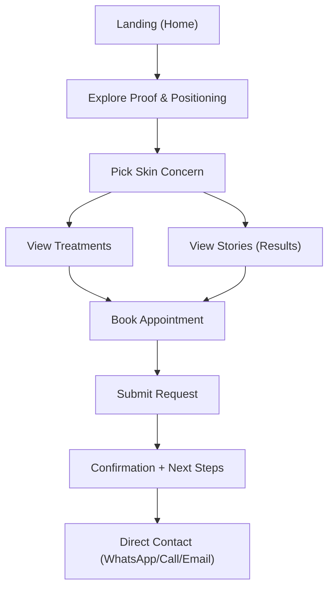

## 1. Product Overview
Belléco Skin Beauté is a premium “skin transformation centre” website focused on showcasing results and converting visitors into booked consultations.
- Target users: Kuala Lumpur customers looking for acne/pigmentation/aging-reversal solutions and a trusted skin specialist
- Target value: increase bookings via clear positioning, social proof, and a frictionless appointment request flow

## 2. Core Features

### 2.1 User Roles (if applicable)
Not required (public marketing + booking).

### 2.2 Feature Module
1. **Home**: brand positioning, signature promise, proof sections, quick booking CTA
2. **Treatments**: treatments/services catalog, suitable-for mapping by skin concern, pricing guidance (optional ranges), FAQ
3. **Stories (Results)**: transformation stories, testimonials, care journey education, trust signals
4. **Book**: appointment request form, preferred contact channel, confirmation state, policy consent

### 2.3 Page Details
| Page Name | Module Name | Feature description |
|-----------|-------------|---------------------|
| Home | Hero + value proposition | Clear promise (“skin transformation”), immediate CTA to booking, subtle motion on load |
| Home | Proof strip | Highlights like “diagnosis-first”, “custom plan”, “clinic-grade protocol”, “results-led care” |
| Home | Concern navigator | Let users select concern (acne/pigmentation/aging/dullness/sensitivity) and deep-link to matching content |
| Home | Social proof | Testimonials carousel + “before/after” style story cards (no medical claims) |
| Home | Location & contact | Address, phone, email, opening hours, map link buttons |
| Treatments | Treatment list | Cards with benefits, suitable-for, duration estimate, starting price range (optional), CTA to book |
| Treatments | Consultation explanation | What happens in consultation: diagnosis → plan → sessions → maintenance |
| Treatments | FAQ | Preparation, aftercare, frequency, expectations, safety, contraindications (non-medical) |
| Stories | Story grid | Filter by concern; each story has timeline, routine highlights, testimonial, recommended program tag |
| Stories | Education blocks | “Why diagnosis matters”, “Skin barrier basics”, “Anti-aging approach” |
| Book | Booking form | Name, phone, email, preferred contact (WhatsApp/call/email), concern, preferred date/time, notes |
| Book | Confirmation | Success state with next steps + alternate direct contact buttons |
| Book | Policies | Consent checkbox and concise policy text (privacy + cancellation) |

## 3. Core Process
Main visitor flows:
1) Visitor lands on Home → scans positioning → views proof → chooses concern → explores Treatments/Stories → submits appointment request.
2) Visitor arrives from social media → goes directly to Book → submits request → sees confirmation with direct contact options.

## 4. User Interface Design
### 4.1 Design Style
- Direction: clinical-luxury (calm, premium, results-focused)
- Colors: warm porcelain background, deep green/ink for typography, champagne-gold accents
- Buttons: solid primary with subtle sheen, secondary as outlined; strong focus states for accessibility
- Typography: high-contrast editorial serif for headings + modern sans for body; generous line-height
- Layout: desktop-first editorial grid, large negative space, “treatment cards” with refined micro-interactions
- Visual language: abstract skin-texture gradients, soft grain overlay, macro product-like imagery placeholders

### 4.2 Page Design Overview
| Page Name | Module Name | UI Elements |
|-----------|-------------|-------------|
| Home | Hero | Full-bleed gradient texture, headline + subhead, primary CTA, staggered reveal animations |
| Home | Concern navigator | Interactive chips + outcome panel; hover-driven details on desktop |
| Treatments | Treatment cards | Icon-less refined cards, suitable-for tags, “what you’ll feel/what you’ll get” bullets |
| Stories | Story cards | Before/after placeholders, timeline, testimonial quote styling, filters |
| Book | Form | Step-like grouping (contact → concern → schedule), inline validation, success state |

### 4.3 Responsiveness
Desktop-first layout with mobile-adaptive stack:
- Preserve typographic hierarchy and CTA visibility on small screens
- Tap-friendly controls for filters and form inputs
- Reduce motion for users with prefers-reduced-motion

