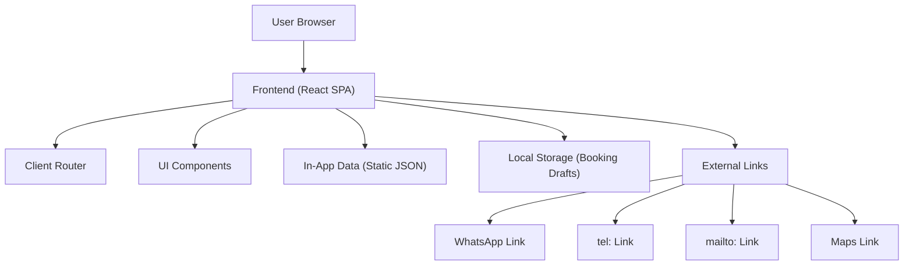
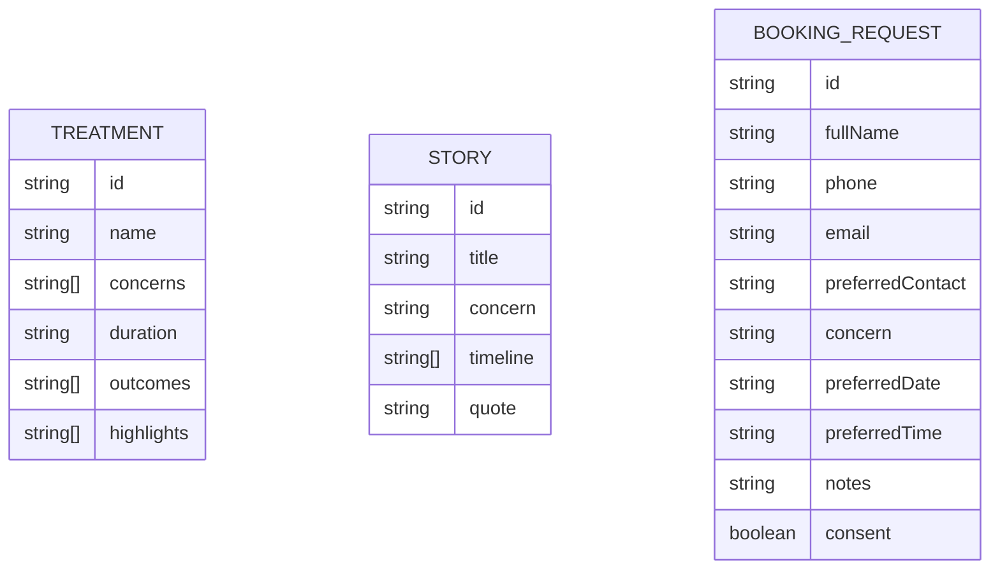

## 1. Architecture Design

## 2. Technology Description
- Frontend: React@18 + TypeScript + tailwindcss@3 + vite
- Initialization Tool: vite-init
- Backend: None (static SPA)
- Data: static JSON modules in-repo + localStorage for user booking drafts

## 3. Route Definitions
| Route | Purpose |
|-------|---------|
| / | Home page (positioning, proof, concern navigator, CTA) |
| /treatments | Treatments catalog + FAQ |
| /stories | Transformation stories + filters |
| /book | Appointment request form + confirmation |

## 4. API Definitions (if backend exists)
None.

## 5. Server Architecture Diagram (if backend exists)
None.

## 6. Data Model (if applicable)
### 6.1 Data Model Definition

### 6.2 Data Definition Language
Not applicable (no database).

